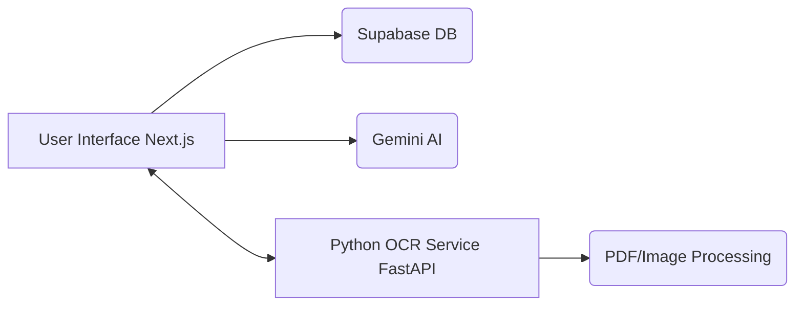

# MMMUT Notice Intelligence Platform

## 1. Overview
The MMMUT Notice Intelligence Platform is a robust web application designed to digitize, index, and query college notices intelligently. Using state-of-the-art Optical Character Recognition (OCR) backed by AI, it automatically processes documents and images, extracting text so that users can search and categorize them easily.

## 2. Features
- **Intelligent Search**: Find notices by keywords, dates, and semantic meaning.
- **Automated OCR Pipeline**: Upload PDF/Image notices and automatically extract text.
- **AI-Powered Summarization**: Leverage Google's Gemini AI to summarize lengthy notices.
- **Cloud Database Integration**: Secure, fast, and scalable database powered by Supabase.
- **Modern UI/UX**: Built with Next.js 15+ and TailwindCSS v4 for a seamless experience.

## 3. Architecture
The application is split into two primary components:
1. **Frontend (Next.js)**: Handles the UI, document uploading, state management, and user interaction. Connects to Supabase for data storage and Gemini for AI tasks.
2. **OCR Service (Python / FastAPI)**: A microservice running `easyocr` and `pymupdf` to parse PDFs and images into structured text.



## 4. Folder Structure
```text
mmmut/
├── .env.example             # Environment variable template
├── README.md                # Project documentation (this file)
├── mmmut/                   # Next.js Frontend Application
│   ├── src/                 # Application source code
│   ├── public/              # Static assets
│   ├── package.json         # Node.js dependencies
│   └── next.config.ts       # Next.js configuration
└── easy_ocr/                # Python OCR Microservice
    ├── main.py              # FastAPI application
    └── requirements.txt     # Python dependencies
```

## 5. Prerequisites
Make sure you have the following installed on your local machine:
- **Git**: For version control.
- **Node.js** (v18 or higher): Required to run the Next.js frontend.
- **Python** (v3.9 or higher): Required to run the OCR service.
- **pip**: Python package installer.

## 6. Clone Repository
If you are starting in an empty IDE folder, you need to initialize Git and clone the repository:

```bash
# Initialize a new git repository (optional if you're directly cloning)
git init

# Clone the repository
git clone https://github.com/nitin99-cyber/mmmut-notices.git .
```
*(Using `.` at the end clones the contents directly into your current directory)*

## 7. Install Frontend
Navigate to the Next.js app directory and install all the Node.js modules:

```bash
# Move into the frontend directory
cd mmmut

# Install dependencies using npm
npm install
```
### Dependency Checklist (`package.json`)
- `next` (^16.2.9)
- `react` (^19.2.4)
- `react-dom` (^19.2.4)
- `@supabase/supabase-js` (^2.108.1)
- `@google/genai` (^2.8.0)
- `zod` (^4.4.3)
- `tailwindcss` (^4.0.0)

## 8. Configure Supabase
1. Go to [Supabase](https://supabase.com/) and create a new project.
2. Under project settings, find your **Project URL** and **anon key**.
3. Copy the `.env.example` file to `.env` in the `mmmut` folder:
```bash
cp .env.example .env
```
4. Paste your Supabase URL and anon key into the `.env` file.

## 9. Configure Gemini
1. Go to [Google AI Studio](https://aistudio.google.com/) and create an API Key.
2. Add your API key to the `GEMINI_API_KEY` variable in your `.env` file.

## 10. Setup OCR Service
Navigate to the Python OCR service directory, create a virtual environment, and install dependencies:

```bash
# From the root directory, navigate to easy_ocr
cd easy_ocr

# Create a virtual environment
python -m venv venv

# Activate the virtual environment
# On Windows:
venv\Scripts\activate
# On macOS/Linux:
source venv/bin/activate

# Install all required libraries at once
pip install -r requirements.txt
```

### Exact `requirements.txt`
```text
fastapi
uvicorn
easyocr
pymupdf
pillow
python-multipart
numpy
torch
torchvision
opencv-python-headless
```

## 11. Run Frontend
With your `.env` configured and node modules installed, start the Next.js development server:

```bash
# From the mmmut directory
npm run dev
```
The frontend will be available at [http://localhost:3000](http://localhost:3000).

## 12. Run OCR Service
In a separate terminal, start the Python FastAPI service:

```bash
# From the easy_ocr directory (ensure venv is activated)
uvicorn main:app --reload --host 0.0.0.0 --port 8000
```
The OCR service will be available at [http://localhost:8000](http://localhost:8000).

## 13. Environment Variables
Your `.env` file should look exactly like this (replace placeholders with actual values):

```env
# Supabase Configuration
NEXT_PUBLIC_SUPABASE_URL=your_supabase_project_url
NEXT_PUBLIC_SUPABASE_ANON_KEY=your_supabase_anon_key

# Google Gemini Configuration
GEMINI_API_KEY=your_gemini_api_key

# Local OCR Service URL
NEXT_PUBLIC_OCR_SERVICE_URL=http://localhost:8000
```

## 14. Database Schema
You will need a table in Supabase to store notices. Create a table named `notices` with the following columns:
- `id` (uuid, primary key)
- `title` (text)
- `content` (text, stores extracted OCR text)
- `summary` (text, generated by Gemini)
- `document_url` (text, link to Supabase storage)
- `created_at` (timestamp)

## 15. API Endpoints
**OCR Service Endpoints:**
- `POST /ocr`: Accepts a `file` (UploadFile) as `multipart/form-data`. Returns JSON containing extracted `text`, `confidence` score, and `image_base64`.

## 16. Troubleshooting
- **Module Not Found (Python)**: Ensure your virtual environment is activated (`venv\Scripts\activate`) before running `pip install` or `uvicorn`.
- **EasyOCR downloading models**: The first time you run the OCR service, EasyOCR will download detection models. This might take a few minutes depending on your internet connection. Don't interrupt it.
- **Supabase CORS Issues**: Ensure `http://localhost:3000` is added to your allowed CORS origins in the Supabase dashboard.
- **Node Modules Error**: If the Next.js app fails to start, delete the `node_modules` folder and `package-lock.json`, then run `npm install` again.

## 17. Deployment
- **Frontend**: Best deployed on [Vercel](https://vercel.com). Just connect your GitHub repository and add your environment variables to the Vercel dashboard.
- **OCR Service**: Can be deployed as a Docker container on platforms like Render, Railway, or AWS EC2. Ensure you have enough RAM (at least 2GB) since PyTorch and EasyOCR require significant memory.

## 18. Roadmap
- [ ] Add vector embeddings for semantic search (pgvector).
- [ ] Support batch uploading of multiple notices at once.
- [ ] Implement user authentication and role-based access.
- [ ] Improve mobile responsiveness for the Next.js UI.
