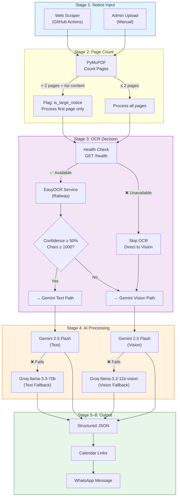
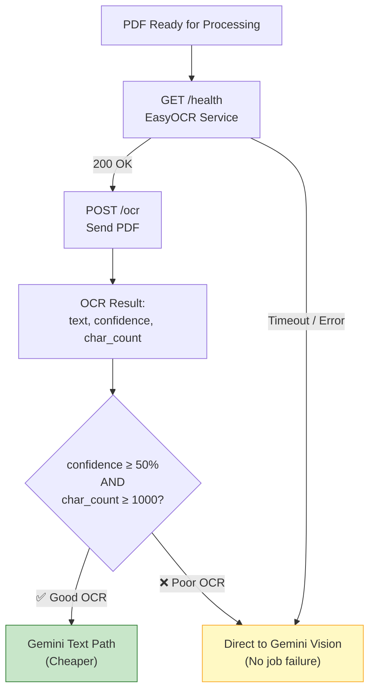
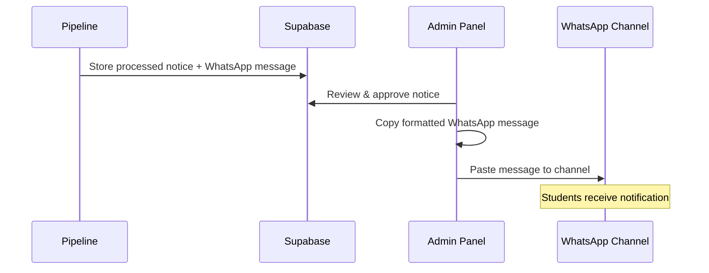
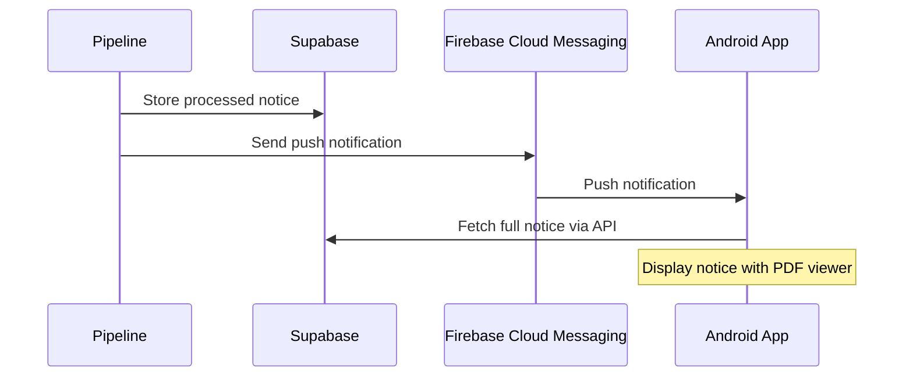
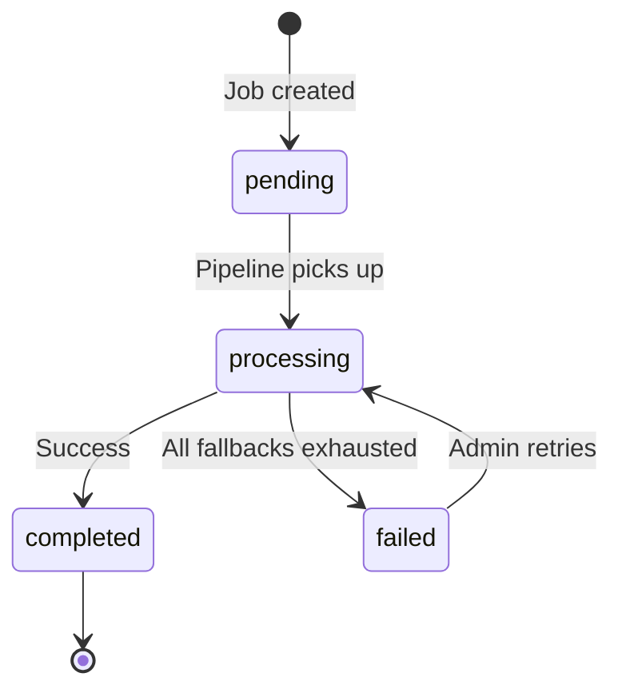

# AI Processing Pipeline

## Overview

The AI Pipeline is the core intelligence layer of the MMMUT Notice Intelligence Platform. It transforms unstructured university notice PDFs — often scanned, Hindi-language, and poorly formatted — into structured, student-friendly content ready for WhatsApp distribution.

Every notice flows through a multi-stage pipeline that automatically selects the optimal processing path based on document characteristics and service availability. The system is designed for **zero manual intervention** in the common case, with graceful fallbacks at every stage.


---

## Pipeline Architecture



---

## Stage 1: Notice Input

Notices enter the pipeline from one of two sources:

| Source | Trigger | Use Case |
|--------|---------|----------|
| **Web Scraper** | GitHub Actions cron (every 30 min) | Automated discovery of new notices from MMMUT website |
| **Admin Upload** | Manual via Admin Panel | Notices from other sources, corrections, urgent announcements |

**Input payload for both sources:**

```typescript
interface NoticeInput {
  pdf_url: string;          // URL to the PDF file
  pdf_buffer?: Buffer;      // Raw PDF bytes (for admin uploads)
  title: string;            // Notice title from website or admin
  published_date: string;   // Date from website or admin input
  source_url: string;       // Original webpage URL
  source: 'scraper' | 'admin';
}
```

---

## Stage 2: Page Count Detection

Before any OCR or AI processing, the pipeline inspects the PDF to determine its size and nature. This is critical for cost and time optimization — a 20-page hostel allotment list should not consume 20× the AI credits of a single-page exam notice.

**Implementation:**

```python
import fitz  # PyMuPDF

def analyze_pdf(pdf_bytes: bytes) -> dict:
    doc = fitz.open(stream=pdf_bytes, filetype="pdf")
    page_count = len(doc)

    # Heuristic: detect list-heavy documents
    first_page_text = doc[0].get_text() if page_count > 0 else ""
    is_list_content = detect_list_pattern(first_page_text)

    is_large_notice = page_count > 2 and is_list_content

    return {
        "page_count": page_count,
        "is_large_notice": is_large_notice,
        "pages_to_process": 1 if is_large_notice else page_count
    }
```

**Decision logic:**

| Condition | Action |
|-----------|--------|
| Pages ≤ 2 | Process all pages normally |
| Pages > 2 **AND** content is a list (roll numbers, names, hostel allotment) | Flag `is_large_notice = true`, process only first page |
| Pages > 2 **AND** content is regular text (circular, policy document) | Process all pages normally |

**List detection heuristics:**
- High density of numbers (roll numbers)
- Repetitive table structures
- Common headers: "S.No.", "Roll No.", "Name", "Branch"
- Low ratio of unique words to total words

---

## Stage 3: OCR Decision Engine

The OCR Decision Engine determines the optimal text extraction path. It prioritizes EasyOCR (free, self-hosted) but seamlessly falls back to Gemini Vision when OCR is unavailable or produces low-quality output.



**Health check details:**
- Endpoint: `GET {EASYOCR_URL}/health`
- Timeout: 5 seconds
- Expected response: `{"status": "healthy", "timestamp": "..."}`
- Any non-200 or timeout → treat as unavailable

**OCR quality thresholds:**

| Metric | Threshold | Rationale |
|--------|-----------|-----------|
| Confidence | ≥ 50% | Below this, OCR text has too many errors for reliable AI processing |
| Character Count | ≥ 1000 | Very short output suggests OCR missed most of the content |

**Key design decision:** When EasyOCR is unavailable, the pipeline does **not** fail. It silently switches to Gemini Vision, which can read PDFs directly. This ensures notices are always processed, even during Railway downtime.

---

## Stage 4: AI Processing

### Primary: Gemini (gemini-2.5-flash)

Gemini is the primary AI provider. It receives either extracted OCR text or the raw PDF and returns structured JSON.

**Text Path** (when OCR succeeds):

```typescript
const response = await gemini.generateContent({
  model: "gemini-2.5-flash",
  contents: [{
    role: "user",
    parts: [{
      text: `${SYSTEM_PROMPT}\n\nNotice text:\n${ocrText}`
    }]
  }],
  generationConfig: {
    responseMimeType: "application/json",
    responseSchema: NOTICE_SCHEMA
  }
});
```

**Vision Path** (when OCR fails or is unavailable):

```typescript
const response = await gemini.generateContent({
  model: "gemini-2.5-flash",
  contents: [{
    role: "user",
    parts: [
      { text: SYSTEM_PROMPT },
      {
        inlineData: {
          mimeType: "application/pdf",
          data: pdfBase64  // First page only for large notices
        }
      }
    ]
  }],
  generationConfig: {
    responseMimeType: "application/json",
    responseSchema: NOTICE_SCHEMA
  }
});
```

### Fallback: Groq

When Gemini fails (rate limit, API error, timeout), the pipeline switches to Groq with equivalent models:

| Path | Gemini Model | Groq Fallback Model |
|------|-------------|---------------------|
| Text | gemini-2.5-flash | llama-3.3-70b-versatile |
| Vision | gemini-2.5-flash (multimodal) | llama-3.2-11b-vision-preview |

**Groq text fallback:**

```typescript
const response = await groq.chat.completions.create({
  model: "llama-3.3-70b-versatile",
  messages: [
    { role: "system", content: SYSTEM_PROMPT },
    { role: "user", content: `Process this notice:\n${ocrText}` }
  ],
  response_format: { type: "json_object" }
});
```

**Groq vision fallback:**

```typescript
const response = await groq.chat.completions.create({
  model: "llama-3.2-11b-vision-preview",
  messages: [
    { role: "system", content: SYSTEM_PROMPT },
    {
      role: "user",
      content: [
        { type: "text", text: "Process this notice PDF:" },
        {
          type: "image_url",
          image_url: { url: `data:image/png;base64,${pageImageBase64}` }
        }
      ]
    }
  ],
  response_format: { type: "json_object" }
});
```

> [!NOTE]
> The same system prompt and output schema are used across all four processing paths (Gemini Text, Gemini Vision, Groq Text, Groq Vision). This ensures consistent output regardless of which path is taken.

---

## Stage 5: Output Schema

Every processed notice produces a standardized JSON object:

```json
{
  "title": "End Semester Examination Schedule - B.Tech 3rd Year",
  "summary": "The university has released the examination schedule for B.Tech 3rd year students. Exams begin on July 15, 2026 and end on August 2, 2026.",
  "english_translation": "Full English translation of the notice content (if original was in Hindi)",
  "category": "examination",
  "audience": ["B.Tech", "3rd Year"],
  "important_dates": [
    { "title": "Exams Begin", "date": "2026-07-15" },
    { "title": "Exams End", "date": "2026-08-02" },
    { "title": "Form Submission Deadline", "date": "2026-07-10" }
  ],
  "is_large_notice": false,
  "page_count": 1,
  "whatsapp_message": "📢 *Exam Schedule - B.Tech 3rd Year*\n\n📝 End semester exams from July 15 to Aug 2, 2026.\n\n⚠️ Form submission deadline: July 10\n\n📅 Add to Calendar: https://calendar.google.com/...\n\n🔗 View notice: https://mmmut.ac.in/...",
  "calendar_events": [
    {
      "title": "MMMUT: Exams Begin - B.Tech 3rd Year",
      "date": "2026-07-15",
      "description": "End semester examinations begin for B.Tech 3rd year students"
    },
    {
      "title": "MMMUT: Form Submission Deadline",
      "date": "2026-07-10",
      "description": "Last date to submit examination forms"
    }
  ],
  "processing_method": "gemini_text"
}
```

**Category values:**

| Category | Examples |
|----------|----------|
| `examination` | Exam schedules, date sheets, seating arrangements |
| `academic` | Syllabus changes, course registrations, academic calendar |
| `admission` | Counselling schedules, merit lists, fee structures |
| `hostel` | Hostel allotment, mess menu, hostel rules |
| `placement` | Company visits, placement drives, internship opportunities |
| `scholarship` | Scholarship announcements, fee waivers |
| `event` | Cultural events, sports, workshops, seminars |
| `administrative` | Office orders, holiday notices, general circulars |
| `result` | Exam results, grade cards |
| `other` | Anything that doesn't fit above categories |

**Processing method values:**

| Value | Meaning |
|-------|---------|
| `gemini_text` | EasyOCR succeeded → Gemini processed text |
| `gemini_vision` | OCR failed/unavailable → Gemini processed PDF directly |
| `groq_text` | Gemini failed → Groq processed OCR text |
| `groq_vision` | Gemini failed + OCR failed → Groq processed PDF image |

---

## Stage 6: Calendar Event Generation

For notices containing deadlines, exam dates, or event schedules, the pipeline generates Google Calendar add-to-calendar links.

**Calendar URL format:**

```
https://calendar.google.com/calendar/render?action=TEMPLATE
  &text=MMMUT%3A%20Exam%20Begins
  &dates=20260715/20260716
  &details=End%20semester%20examinations%20begin
  &sf=true
  &output=xml
```

**URL generation logic:**

```typescript
function generateCalendarUrl(event: CalendarEvent): string {
  const startDate = event.date.replace(/-/g, '');
  // Default: all-day event (next day as end)
  const endDate = addDays(event.date, 1).replace(/-/g, '');

  const params = new URLSearchParams({
    action: 'TEMPLATE',
    text: event.title,
    dates: `${startDate}/${endDate}`,
    details: event.description,
    sf: 'true',
    output: 'xml'
  });

  return `https://calendar.google.com/calendar/render?${params}`;
}
```

**Which notices get calendar links:**
- ✅ Exam schedules (start date, end date, form deadlines)
- ✅ Admission deadlines (counselling dates, fee payment dates)
- ✅ Event dates (workshops, seminars, cultural events)
- ✅ Scholarship deadlines
- ❌ General circulars (no specific dates)
- ❌ Results (past events)
- ❌ Hostel allotment lists (no deadline)

---

## Stage 7: Large Notice Handling

University notices often include multi-page lists of student names, roll numbers, and allotment details. Processing all pages would waste AI credits and produce unhelpful output (a WhatsApp message listing 500 roll numbers is useless).

**Detection rules:**

```typescript
function isLargeListNotice(pageCount: number, firstPageText: string): boolean {
  if (pageCount <= 2) return false;

  const listIndicators = [
    /s\.?\s*no\.?/i,           // S.No., S. No
    /roll\s*no\.?/i,           // Roll No., Roll Number
    /\d{7,}/g,                 // 7+ digit numbers (roll numbers)
    /hostel\s*allot/i,         // Hostel allotment
    /merit\s*list/i,           // Merit list
    /selected\s*candidates/i   // Selected candidates
  ];

  const matchCount = listIndicators.filter(r => r.test(firstPageText)).length;
  return matchCount >= 2;
}
```

**Processing behavior:**

| Aspect | Normal Notice | Large Notice |
|--------|--------------|--------------|
| Pages processed | All | First page only |
| AI credits used | Proportional to pages | Fixed (1 page) |
| WhatsApp message | Full summary | Summary + PDF link |
| Output flag | `is_large_notice: false` | `is_large_notice: true` |

**WhatsApp message for large notices:**

```
📢 *Hostel Allotment List - 2026-27*

🏠 The university has released the hostel allotment list for the academic year 2026-27. 
Total 450 students allotted across hostels.

📄 *View full list:* https://mmmut.ac.in/notice/hostel-allotment-2026.pdf

🔗 Source: https://www.mmmut.ac.in/AllRecord
```

---

## Stage 8: Distribution

The final stage delivers the processed notice to students.

**Current distribution (WhatsApp Channel):**



**WhatsApp message format:**

```
📢 *{title}*

{summary}

{important_dates_formatted}

📅 Add to Calendar: {calendar_links}

🔗 View original: {source_url}
```

**Future distribution (Android App):**



---

## Failure Handling

The pipeline is designed to **never silently drop a notice**. Every failure triggers a fallback or a retry.

| Stage | Failure | Action | Recovery |
|-------|---------|--------|----------|
| PDF Download | Network error / 404 | Retry 3 times with exponential backoff | Mark job `failed` after 3 retries |
| Page Count | Corrupted PDF | Log error, attempt processing anyway | Treat as 1-page notice |
| OCR Service | Railway down / timeout | Skip OCR, use Gemini Vision path | No job failure — seamless |
| OCR Quality | Confidence < 50% or chars < 1000 | Switch to Gemini Vision path | Automatic, no retry needed |
| Gemini API | Rate limit (429) | Immediate switch to Groq fallback | No wait, no retry |
| Gemini API | Server error (500/503) | Immediate switch to Groq fallback | No wait, no retry |
| Groq API | Any error | Mark job `failed` | Admin can retry from panel |
| JSON Parsing | AI returns invalid JSON | Retry with same provider (1 attempt) | Then try fallback provider |
| Calendar URL | Invalid date format | Skip calendar link for that date | Notice still published |

**Job status lifecycle:**



---

## Cost Optimization

The entire pipeline is designed to run within free tiers of all services.

| Service | Free Tier | Our Usage | Headroom |
|---------|-----------|-----------|----------|
| **EasyOCR (Railway)** | $5/month credit | ~$2-3/month | Comfortable |
| **Gemini 2.5 Flash** | 15 RPM, 1M tokens/day | ~5-10 notices/day | Large surplus |
| **Groq** | 30 RPM, 6000 tokens/min | Fallback only (~1-2/week) | Rarely used |
| **Supabase** | 500MB storage, 50K rows | ~100KB/notice | Years of capacity |
| **Vercel** | 100GB bandwidth | Minimal (admin only) | Massive surplus |
| **GitHub Actions** | 2000 min/month | ~60 min/month (cron) | 97% unused |

**Cost-saving strategies:**

1. **OCR-first approach:** EasyOCR runs on Railway (free) → if it produces good text, Gemini processes text (cheaper than vision)
2. **Large notice detection:** Process only the first page of list-heavy PDFs → saves 80%+ tokens on long documents
3. **Gemini text vs vision:** Text processing uses ~10× fewer tokens than vision processing
4. **Groq as fallback only:** Groq's free tier is preserved for when Gemini is unavailable
5. **Duplicate detection:** Scraper skips already-processed notices → zero wasted AI calls