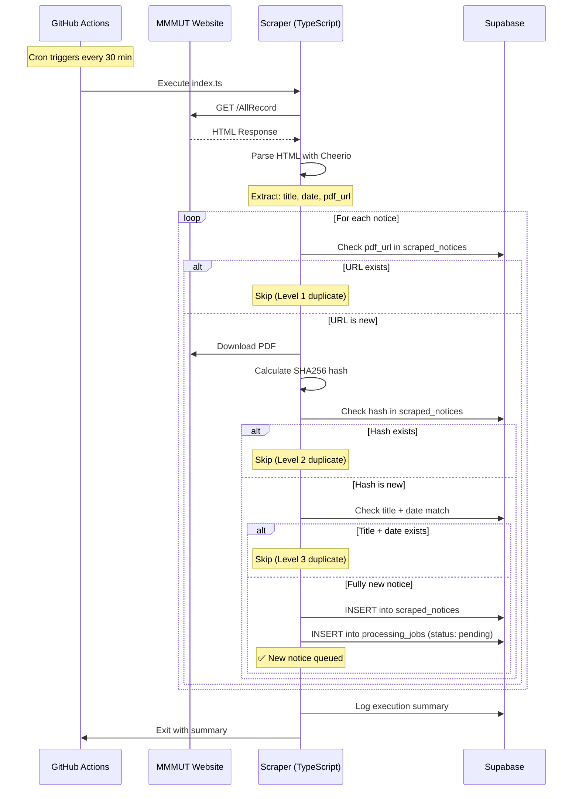
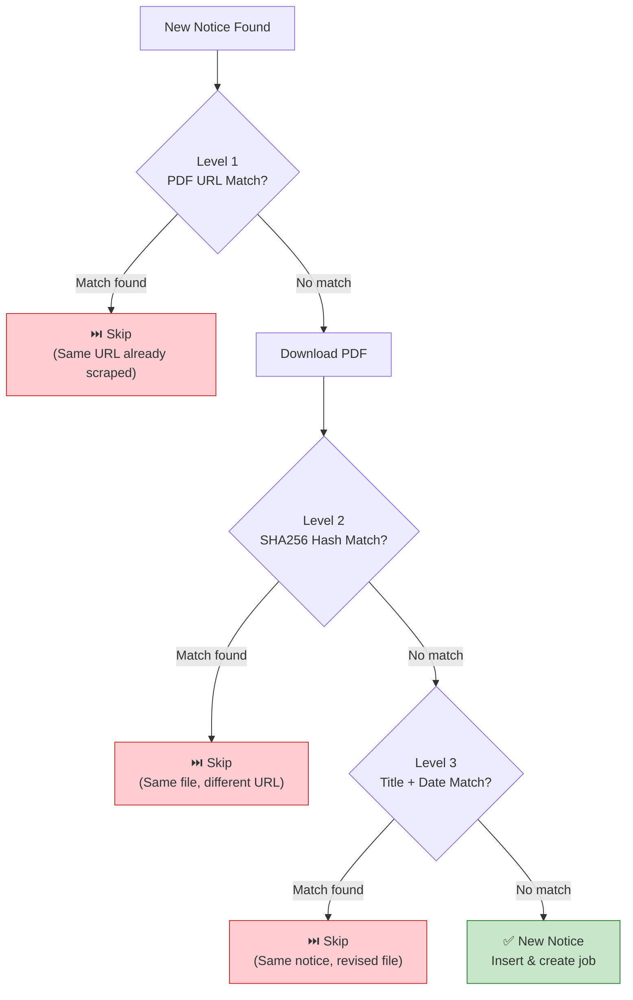
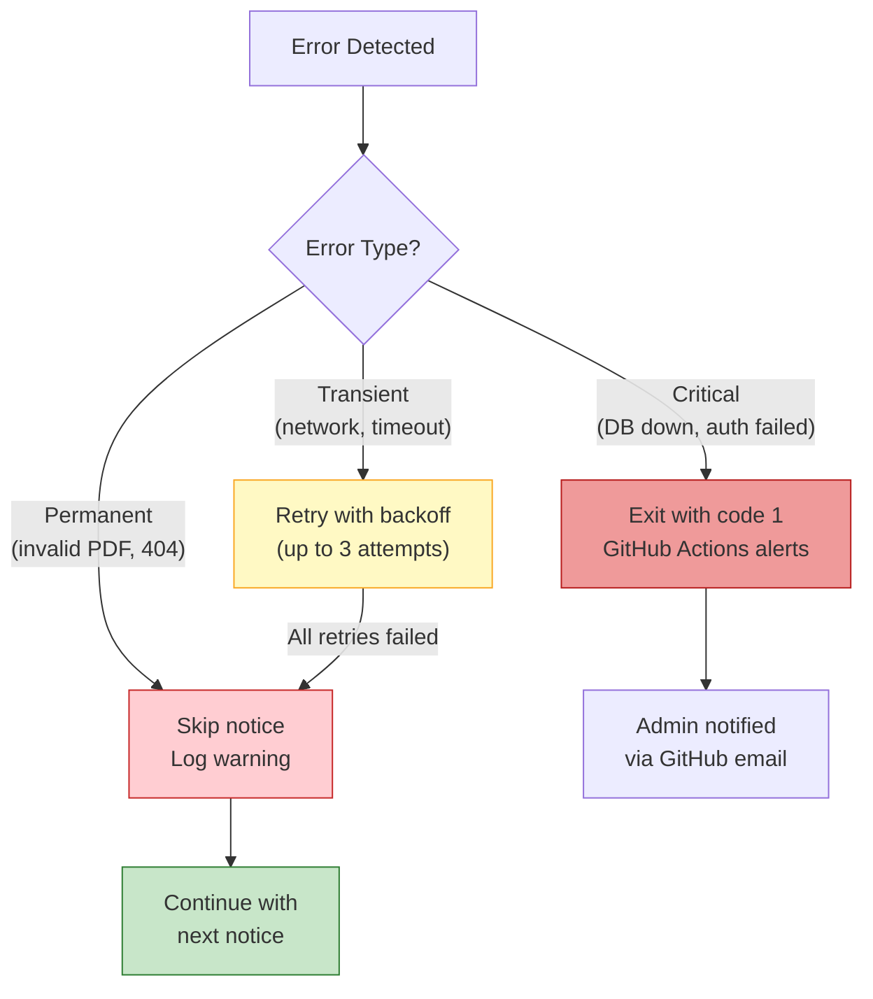

# Web Scraper Service

## Overview

The Web Scraper is a TypeScript-based service that runs on **GitHub Actions every 30 minutes** to automatically discover new notices from the MMMUT university website. It parses the notice listing page, detects duplicates using a triple-layer strategy, and queues new notices for AI processing.

**Key facts:**
- **Runtime:** GitHub Actions (Ubuntu runner, Node.js 20)
- **Schedule:** Every 30 minutes via cron (`*/30 * * * *`)
- **Language:** TypeScript (executed via `tsx`)
- **Parser:** Cheerio (jQuery-like HTML parsing)
- **Storage:** Supabase PostgreSQL
- **Target:** `https://www.mmmut.ac.in/AllRecord`
- **Cost:** $0 (GitHub Actions free tier — 2000 min/month, we use ~60 min/month)

---

## Architecture

```mermaid
flowchart LR
    subgraph GHA["GitHub Actions"]
        CRON["⏰ Cron\nEvery 30 min"]
        ENTRY["index.ts"]
        CRON --> ENTRY
    end

    subgraph Scraping["Scrape & Parse"]
        FETCH["Fetch HTML\nnode-fetch"]
        PARSE["Parse Notices\nCheerio"]
        FETCH --> PARSE
    end

    subgraph Dedup["Duplicate Detection"]
        URL["Level 1\nPDF URL Match"]
        HASH["Level 2\nSHA256 Hash"]
        TITLE["Level 3\nTitle + Date"]
        URL --> HASH --> TITLE
    end

    subgraph Output["Output"]
        DB["Supabase\nscraped_notices"]
        JOBS["Supabase\nprocessing_jobs"]
    end

    ENTRY --> FETCH
    PARSE --> URL
    TITLE -->|"New notice"| DB
    DB --> JOBS

    style GHA fill:#e3f2fd,stroke:#1565c0
    style Dedup fill:#fff3e0,stroke:#ef6c00
    style Output fill:#e8f5e9,stroke:#2e7d32
```



---

## Target URL

| Property | Value |
|----------|-------|
| URL | `https://www.mmmut.ac.in/AllRecord` |
| Content | HTML page listing all university notices |
| Structure | Table/list with notice title, date, and PDF download link |
| Update frequency | Multiple times daily (unpredictable) |
| Encoding | UTF-8 (Hindi + English content) |

---

## Scraper Workflow



### Step-by-Step Breakdown

1. **Fetch HTML** — HTTP GET request to `https://www.mmmut.ac.in/AllRecord` with a browser-like User-Agent header
2. **Parse with Cheerio** — Extract structured data from each notice row:
   - `title` — Notice title text
   - `published_date` — Date from the listing
   - `pdf_url` — Absolute URL to the PDF download
3. **Duplicate detection** — For each parsed notice, run through three levels of dedup checks
4. **Download PDF** — If the notice passes dedup, download the PDF binary
5. **Hash generation** — Calculate SHA256 hash of the PDF content
6. **Store notice** — Insert into `scraped_notices` table
7. **Create job** — Insert into `processing_jobs` table with `status: 'pending'`
8. **Log summary** — Record execution statistics

---

## Duplicate Detection

The scraper uses a **triple-layer duplicate detection** strategy to ensure no notice is processed twice, even if the university re-uploads a notice with a different URL or title.



### Level 1: PDF URL Match (Fast, Primary)

```typescript
// Check if this exact PDF URL has already been scraped
const existing = await supabase
  .from('scraped_notices')
  .select('id')
  .eq('pdf_url', notice.pdfUrl)
  .single();

if (existing.data) {
  logger.debug(`Duplicate (URL): ${notice.title}`);
  return 'duplicate';
}
```

**Why:** Most notices have a unique, stable URL. This catches 90%+ of duplicates with a fast database lookup — no PDF download needed.

### Level 2: SHA256 File Hash (Catches Re-uploads)

```typescript
// Download the PDF and hash it
const pdfBuffer = await downloadPdf(notice.pdfUrl);
const hash = crypto
  .createHash('sha256')
  .update(pdfBuffer)
  .digest('hex');

const existing = await supabase
  .from('scraped_notices')
  .select('id')
  .eq('file_hash', hash)
  .single();

if (existing.data) {
  logger.debug(`Duplicate (Hash): ${notice.title}`);
  return 'duplicate';
}
```

**Why:** Sometimes the university uploads the same PDF to a new URL (e.g., website migration, file reorganization). The SHA256 hash catches these because identical files produce identical hashes.

### Level 3: Title + Date Match (Final Fallback)

```typescript
// Fuzzy match on title and exact match on date
const existing = await supabase
  .from('scraped_notices')
  .select('id')
  .eq('published_date', notice.publishedDate)
  .ilike('title', `%${normalizeTitle(notice.title)}%`)
  .single();

if (existing.data) {
  logger.debug(`Duplicate (Title+Date): ${notice.title}`);
  return 'duplicate';
}
```

**Why:** Rarely, the university may revise a notice (minor edits) and re-upload it. The file hash will differ, but the title and date usually stay the same. This catches those cases.

---

## GitHub Actions Workflow

```yaml
name: Scrape MMMUT Notices

on:
  schedule:
    # Run every 30 minutes
    - cron: '*/30 * * * *'
  workflow_dispatch:
    # Allow manual trigger from GitHub UI

jobs:
  scrape:
    runs-on: ubuntu-latest
    timeout-minutes: 10

    steps:
      - name: Checkout repository
        uses: actions/checkout@v4

      - name: Setup Node.js 20
        uses: actions/setup-node@v4
        with:
          node-version: 20
          cache: 'npm'
          cache-dependency-path: scraper/package-lock.json

      - name: Install dependencies
        working-directory: scraper
        run: npm ci

      - name: Run scraper
        working-directory: scraper
        run: npx tsx src/index.ts
        env:
          SUPABASE_URL: ${{ secrets.SUPABASE_URL }}
          SUPABASE_SERVICE_ROLE_KEY: ${{ secrets.SUPABASE_SERVICE_ROLE_KEY }}
          SCRAPE_URL: https://www.mmmut.ac.in/AllRecord
          MAX_NOTICES_PER_RUN: 50

      - name: Upload logs (on failure)
        if: failure()
        uses: actions/upload-artifact@v4
        with:
          name: scraper-logs
          path: scraper/logs/
          retention-days: 7
```

**GitHub Actions secrets required:**

| Secret | Description |
|--------|-------------|
| `SUPABASE_URL` | Supabase project URL (e.g., `https://xxxx.supabase.co`) |
| `SUPABASE_SERVICE_ROLE_KEY` | Service role key for server-side database access |

---

## Folder Structure

```
scraper/
├── package.json            # Dependencies: cheerio, @supabase/supabase-js, node-fetch
├── package-lock.json
├── tsconfig.json            # TypeScript configuration (target: ES2022)
└── src/
    ├── index.ts             # Main entry point — orchestrates the scrape cycle
    ├── config.ts            # Environment variable loading and validation
    ├── supabase.ts          # Supabase client initialization
    ├── parser.ts            # Cheerio HTML parser — extracts notice data
    ├── duplicate.ts         # Triple-layer duplicate detection logic
    ├── downloader.ts        # PDF download with retry logic
    ├── hash.ts              # SHA256 hash generation
    ├── queue.ts             # Processing job creation in Supabase
    └── logger.ts            # Structured logging with execution summaries
```

---

## Module Details

### `index.ts` — Main Entry Point

**Responsibility:** Orchestrates the entire scrape cycle from start to finish.

```typescript
// Simplified flow
async function main() {
  const config = loadConfig();
  const supabase = initSupabase(config);
  const logger = new Logger();

  try {
    // 1. Fetch and parse
    const html = await fetch(config.scrapeUrl);
    const notices = parseNotices(await html.text());

    // 2. Process each notice
    let newCount = 0;
    let dupCount = 0;

    for (const notice of notices.slice(0, config.maxNoticesPerRun)) {
      const result = await processNotice(notice, supabase, logger);
      if (result === 'new') newCount++;
      else dupCount++;
    }

    // 3. Log summary
    logger.summary({
      total_found: notices.length,
      new_notices: newCount,
      duplicates_skipped: dupCount,
    });
  } catch (error) {
    logger.error('Scraper failed', error);
    process.exit(1);
  }
}
```

**Inputs:** Environment variables (via `config.ts`)
**Outputs:** New rows in `scraped_notices` and `processing_jobs` tables

---

### `config.ts` — Environment Configuration

**Responsibility:** Load and validate all environment variables.

```typescript
interface Config {
  scrapeUrl: string;         // MMMUT notice page URL
  supabaseUrl: string;       // Supabase project URL
  supabaseKey: string;       // Service role key
  maxNoticesPerRun: number;  // Safety limit (default: 50)
  requestTimeout: number;    // HTTP timeout in ms (default: 30000)
  userAgent: string;         // Browser-like User-Agent header
}

export function loadConfig(): Config {
  const config: Config = {
    scrapeUrl: requireEnv('SCRAPE_URL'),
    supabaseUrl: requireEnv('SUPABASE_URL'),
    supabaseKey: requireEnv('SUPABASE_SERVICE_ROLE_KEY'),
    maxNoticesPerRun: parseInt(process.env.MAX_NOTICES_PER_RUN || '50'),
    requestTimeout: 30000,
    userAgent: 'Mozilla/5.0 (compatible; MMMUT-Notice-Bot/1.0)',
  };
  return config;
}
```

---

### `parser.ts` — Cheerio HTML Parser

**Responsibility:** Parse the MMMUT notice page HTML and extract structured notice data.

```typescript
interface ParsedNotice {
  title: string;
  publishedDate: string;    // YYYY-MM-DD
  pdfUrl: string;           // Absolute URL
  sourceUrl: string;        // Page URL
}

export function parseNotices(html: string): ParsedNotice[] {
  const $ = cheerio.load(html);
  const notices: ParsedNotice[] = [];

  // Select each notice row from the table/list
  $('table tr, .notice-item').each((_, element) => {
    const title = $(element).find('.notice-title, td:first-child').text().trim();
    const dateText = $(element).find('.notice-date, td:nth-child(2)').text().trim();
    const pdfLink = $(element).find('a[href$=".pdf"]').attr('href');

    if (title && pdfLink) {
      notices.push({
        title,
        publishedDate: parseDate(dateText),
        pdfUrl: resolveUrl(pdfLink, 'https://www.mmmut.ac.in'),
        sourceUrl: 'https://www.mmmut.ac.in/AllRecord',
      });
    }
  });

  return notices;
}
```

**Inputs:** Raw HTML string
**Outputs:** Array of `ParsedNotice` objects

> [!WARNING]
> The HTML selectors are based on the current MMMUT website structure. If the university redesigns their website, these selectors will need to be updated. The scraper logs parsing failures to alert the admin.

---

### `duplicate.ts` — Duplicate Detection

**Responsibility:** Implement the triple-layer dedup strategy.

```typescript
type DuplicateResult = 'new' | 'duplicate_url' | 'duplicate_hash' | 'duplicate_title';

export async function checkDuplicate(
  notice: ParsedNotice,
  pdfHash: string,
  supabase: SupabaseClient
): Promise<DuplicateResult> {
  // Level 1: URL match
  const urlMatch = await supabase
    .from('scraped_notices')
    .select('id')
    .eq('pdf_url', notice.pdfUrl)
    .maybeSingle();
  if (urlMatch.data) return 'duplicate_url';

  // Level 2: Hash match
  const hashMatch = await supabase
    .from('scraped_notices')
    .select('id')
    .eq('file_hash', pdfHash)
    .maybeSingle();
  if (hashMatch.data) return 'duplicate_hash';

  // Level 3: Title + date match
  const titleMatch = await supabase
    .from('scraped_notices')
    .select('id')
    .eq('published_date', notice.publishedDate)
    .ilike('title', `%${notice.title.substring(0, 50)}%`)
    .maybeSingle();
  if (titleMatch.data) return 'duplicate_title';

  return 'new';
}
```

**Inputs:** `ParsedNotice`, SHA256 hash, Supabase client
**Outputs:** Duplicate classification result

---

### `downloader.ts` — PDF Download

**Responsibility:** Download PDF files with retry logic and timeout handling.

```typescript
export async function downloadPdf(
  url: string,
  config: Config
): Promise<Buffer> {
  const maxRetries = 3;

  for (let attempt = 1; attempt <= maxRetries; attempt++) {
    try {
      const response = await fetch(url, {
        headers: { 'User-Agent': config.userAgent },
        signal: AbortSignal.timeout(config.requestTimeout),
      });

      if (!response.ok) {
        throw new Error(`HTTP ${response.status}: ${response.statusText}`);
      }

      const buffer = Buffer.from(await response.arrayBuffer());

      // Validate it's actually a PDF
      if (buffer.length < 100 || !buffer.toString('ascii', 0, 5).startsWith('%PDF')) {
        throw new Error('Downloaded file is not a valid PDF');
      }

      return buffer;
    } catch (error) {
      if (attempt === maxRetries) throw error;
      // Exponential backoff: 1s, 2s, 4s
      await sleep(1000 * Math.pow(2, attempt - 1));
    }
  }

  throw new Error('Unreachable');
}
```

**Inputs:** PDF URL, config (timeout, user agent)
**Outputs:** PDF as Buffer
**Retries:** 3 attempts with exponential backoff (1s, 2s, 4s)

---

### `hash.ts` — SHA256 Generation

**Responsibility:** Generate deterministic file hashes for duplicate detection.

```typescript
import crypto from 'crypto';

export function generateHash(buffer: Buffer): string {
  return crypto.createHash('sha256').update(buffer).digest('hex');
}
```

**Inputs:** PDF Buffer
**Outputs:** 64-character hex string (SHA256 hash)

---

### `queue.ts` — Job Creation

**Responsibility:** Insert new notices and create processing jobs in Supabase.

```typescript
export async function createNoticeAndJob(
  notice: ParsedNotice,
  pdfHash: string,
  supabase: SupabaseClient
): Promise<{ noticeId: string; jobId: string }> {
  // 1. Insert scraped notice
  const { data: noticeData } = await supabase
    .from('scraped_notices')
    .insert({
      title: notice.title,
      pdf_url: notice.pdfUrl,
      source_url: notice.sourceUrl,
      file_hash: pdfHash,
      published_date: notice.publishedDate,
    })
    .select('id')
    .single();

  // 2. Create processing job
  const { data: jobData } = await supabase
    .from('processing_jobs')
    .insert({
      notice_id: noticeData.id,
      status: 'pending',
      retry_count: 0,
    })
    .select('id')
    .single();

  return {
    noticeId: noticeData.id,
    jobId: jobData.id,
  };
}
```

**Inputs:** `ParsedNotice`, file hash, Supabase client
**Outputs:** Created notice ID and job ID

---

### `logger.ts` — Execution Logging

**Responsibility:** Structured logging for each scraper run.

```typescript
interface ExecutionSummary {
  timestamp: string;
  total_notices_found: number;
  new_notices: number;
  duplicates_skipped: number;
  duplicate_breakdown: {
    url_matches: number;
    hash_matches: number;
    title_matches: number;
  };
  failures: number;
  failure_details: string[];
  duration_ms: number;
}

export class Logger {
  private startTime: number;
  private logs: string[] = [];

  constructor() {
    this.startTime = Date.now();
  }

  info(message: string): void {
    const log = `[INFO] ${new Date().toISOString()} ${message}`;
    console.log(log);
    this.logs.push(log);
  }

  error(message: string, error?: unknown): void {
    const log = `[ERROR] ${new Date().toISOString()} ${message}: ${error}`;
    console.error(log);
    this.logs.push(log);
  }

  summary(stats: Partial<ExecutionSummary>): void {
    const summary: ExecutionSummary = {
      timestamp: new Date().toISOString(),
      duration_ms: Date.now() - this.startTime,
      total_notices_found: 0,
      new_notices: 0,
      duplicates_skipped: 0,
      duplicate_breakdown: { url_matches: 0, hash_matches: 0, title_matches: 0 },
      failures: 0,
      failure_details: [],
      ...stats,
    };
    console.log('\n=== SCRAPER EXECUTION SUMMARY ===');
    console.log(JSON.stringify(summary, null, 2));
    console.log('=================================\n');
  }
}
```

---

## Error Handling

The scraper is designed to be **resilient** — a single failure should not stop the entire run. Each notice is processed independently.

| Error Scenario | Detection | Action | Impact |
|---------------|-----------|--------|--------|
| **MMMUT website down** | HTTP 5xx or timeout | Log error, exit gracefully | No notices processed this cycle; next cron will retry |
| **HTML structure changed** | Zero notices parsed from valid HTML | Log warning with HTML snippet, alert admin | Requires manual selector update |
| **PDF download failed** | HTTP error or timeout after 3 retries | Mark as failed in log, skip this notice | Single notice missed; can be manually uploaded |
| **Supabase unavailable** | Connection error | Exit with error code 1 | GitHub Actions marks run as failed |
| **Duplicate found** | Any dedup level matches | Skip silently (debug log only) | Expected behavior — not an error |
| **Invalid PDF** | File doesn't start with `%PDF` | Log warning, skip notice | Rare — usually means link pointed to HTML page |
| **Rate limiting** | HTTP 429 from MMMUT website | Respect `Retry-After` header, slow down | Adds delay but doesn't fail |

**Error escalation:**



---

## Logging

Every scraper run produces a structured execution summary. This is critical for monitoring since the scraper runs unattended on GitHub Actions.

**Example successful run:**

```json
{
  "timestamp": "2026-07-06T04:09:08.000Z",
  "total_notices_found": 25,
  "new_notices": 2,
  "duplicates_skipped": 23,
  "duplicate_breakdown": {
    "url_matches": 21,
    "hash_matches": 1,
    "title_matches": 1
  },
  "failures": 0,
  "failure_details": [],
  "duration_ms": 4520
}
```

**Example run with failures:**

```json
{
  "timestamp": "2026-07-06T04:39:08.000Z",
  "total_notices_found": 25,
  "new_notices": 1,
  "duplicates_skipped": 23,
  "failures": 1,
  "failure_details": [
    "Failed to download PDF: https://mmmut.ac.in/pdf/notice-456.pdf (HTTP 404 after 3 retries)"
  ],
  "duration_ms": 12300
}
```

**Where logs go:**
- **stdout/stderr** — Captured by GitHub Actions and viewable in the workflow run logs
- **Supabase** (planned) — Store execution summaries in a `scraper_runs` table for the admin dashboard

---

## Configuration

| Variable | Required | Default | Description |
|----------|----------|---------|-------------|
| `SCRAPE_URL` | Yes | — | Target URL: `https://www.mmmut.ac.in/AllRecord` |
| `SUPABASE_URL` | Yes | — | Supabase project URL |
| `SUPABASE_SERVICE_ROLE_KEY` | Yes | — | Server-side Supabase key (not the anon key) |
| `MAX_NOTICES_PER_RUN` | No | `50` | Safety limit to prevent runaway scraping |
| `REQUEST_TIMEOUT` | No | `30000` | HTTP request timeout in milliseconds |
| `LOG_LEVEL` | No | `info` | Logging verbosity: `debug`, `info`, `warn`, `error` |

> [!CAUTION]
> Never use the Supabase **anon key** for the scraper. The scraper needs the **service role key** because it inserts data directly into tables without going through Row Level Security (RLS).

---

## Monitoring & Maintenance

### Monitoring Checklist

| Check | Frequency | How |
|-------|-----------|-----|
| GitHub Actions runs succeeding | Daily | Check Actions tab for red ❌ marks |
| New notices being discovered | Weekly | Check `scraped_notices` table count |
| No parsing failures | Weekly | Check logs for `[WARN] Zero notices parsed` |
| Supabase storage usage | Monthly | Supabase dashboard → Database → Usage |

### Common Maintenance Tasks

**1. MMMUT website structure changed:**
- Symptom: Zero notices parsed despite website having notices
- Fix: Update Cheerio selectors in `parser.ts`
- Test: Run scraper manually with `workflow_dispatch`

**2. Scraper finding zero new notices for days:**
- Check: Is the university actually posting new notices?
- Check: Did the PDF URL format change?
- Check: Is the date parsing correct?

**3. GitHub Actions quota approaching limit:**
- Current usage: ~60 min/month (cron runs ~1440 times/month × ~2.5 seconds each)
- Free tier: 2000 min/month
- If concerned: Reduce cron frequency to hourly (`0 * * * *`)
