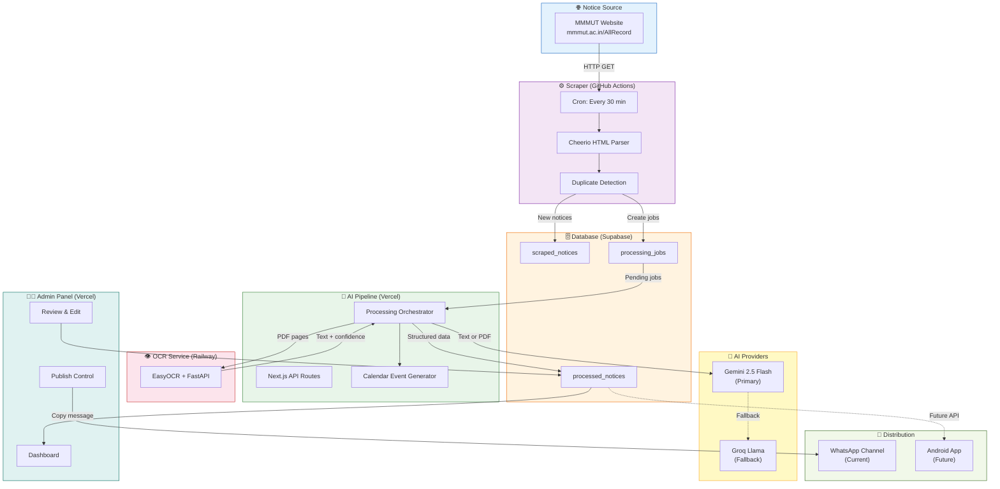
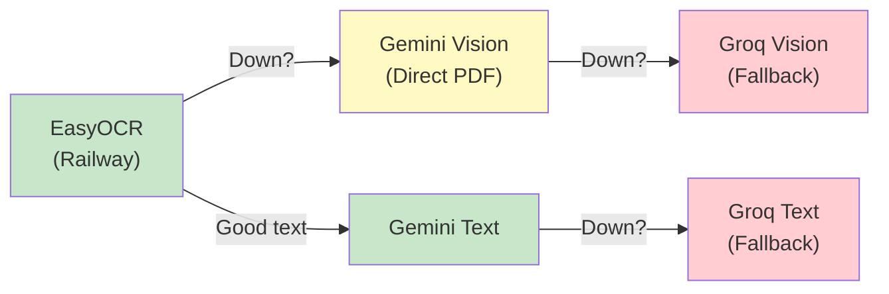
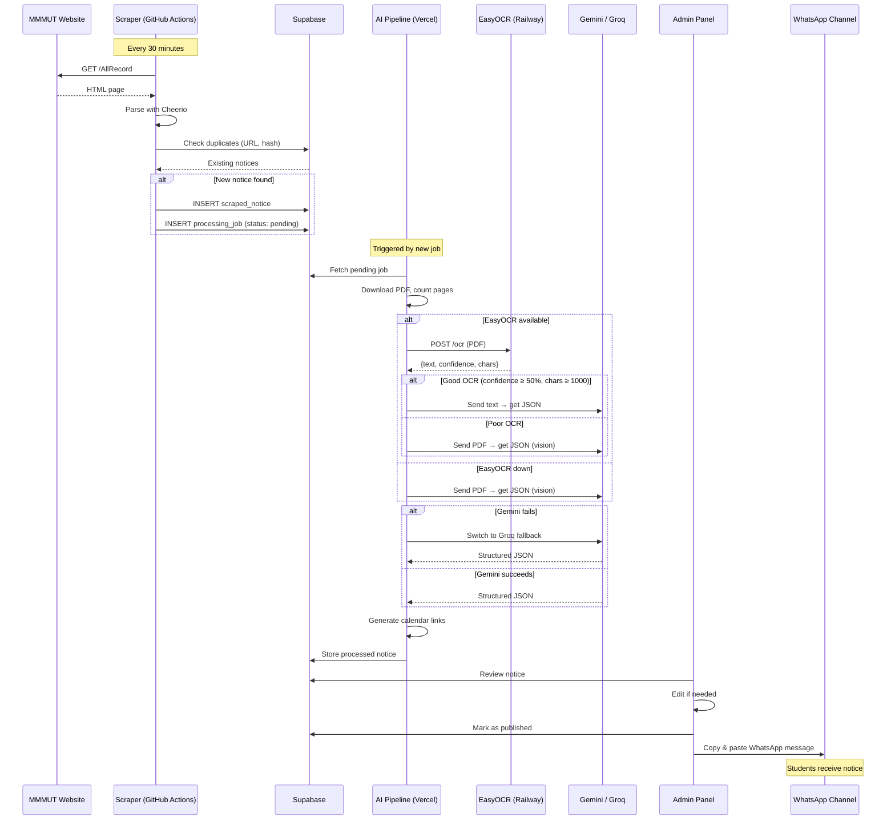
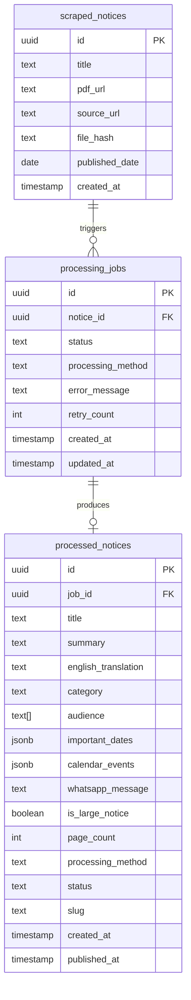
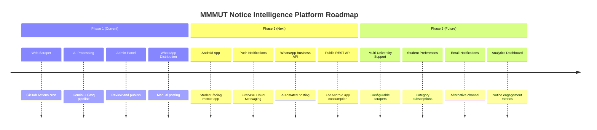

# System Architecture

## Overview

The MMMUT Notice Intelligence Platform is a **zero-cost, AI-powered** notice processing system built for Madan Mohan Malaviya University of Technology, Gorakhpur. It automatically discovers notices from the university website, extracts and structures content using OCR and AI, and distributes student-friendly summaries via WhatsApp.

**Key architectural decisions:**
- **No public student website** — students receive notices via WhatsApp channel (future: Android app)
- **Zero hosting cost** — every service runs on a free tier
- **Fault-tolerant AI pipeline** — triple fallback chain ensures notices are always processed
- **Admin-gated publishing** — AI output is reviewed before reaching students

---

## Architecture Diagram



---

## Design Principles

### 1. Zero Cost Hosting

Every component runs within the free tier of its hosting platform. No credit card charges, no surprise bills, no cost scaling concerns.

| Principle | Implementation |
|-----------|---------------|
| Compute | GitHub Actions (2000 min/month free), Vercel (serverless), Railway ($5 credit) |
| Storage | Supabase PostgreSQL (500MB free) |
| AI | Gemini free tier (15 RPM), Groq free tier (fallback only) |
| Distribution | WhatsApp Channel (free, manual posting) |

### 2. WhatsApp-First Distribution

There is **no public-facing student website**. Students receive notices through:
- **Now:** WhatsApp channel — admin copies AI-generated message and posts it
- **Future:** Android app — push notifications via Firebase, notice feed via API

This decision was made because MMMUT students already use WhatsApp extensively, and a website would require SEO, maintenance, and hosting costs.

### 3. Fault Tolerance

The system has **no single point of failure** in the AI processing chain:



### 4. Process Once, Distribute Everywhere

A notice is processed by the AI pipeline **exactly once**. The structured output is stored in Supabase and can be consumed by:
- WhatsApp message (pre-formatted, ready to copy)
- Future Android app (via REST API)
- Future email notifications
- Any future distribution channel

### 5. Admin Control

No notice reaches students without admin review. The admin can:
- Edit AI-generated summaries before publishing
- Re-categorize notices
- Add or remove calendar events
- Archive irrelevant notices
- Retry failed processing jobs

---

## Services & Deployment

| Service | Technology | Hosting | Free Tier | Cost |
|---------|-----------|---------|-----------|------|
| **Web Scraper** | TypeScript, Cheerio, node-fetch | GitHub Actions (cron) | 2000 min/month | $0 |
| **OCR Service** | Python 3.11, FastAPI, EasyOCR | Railway | $5/month credit | $0 |
| **Admin Panel + API** | Next.js 14, TypeScript, Tailwind | Vercel | 100GB bandwidth | $0 |
| **Database** | PostgreSQL 15 | Supabase | 500MB, 50K rows | $0 |
| **AI Processing** | Gemini 2.5 Flash | Google AI Studio | 15 RPM, 1M tokens/day | $0 |
| **AI Fallback** | Llama 3.3 70B, Llama 3.2 11B Vision | Groq Cloud | 30 RPM | $0 |
| **Distribution** | WhatsApp Channel | WhatsApp | Unlimited | $0 |
| **Total** | | | | **$0/month** |

---

## Component Details

### Web Scraper

**Purpose:** Automatically discover new notices from the MMMUT website.

| Aspect | Detail |
|--------|--------|
| Runtime | GitHub Actions (Ubuntu runner) |
| Schedule | Every 30 minutes (`*/30 * * * *`) |
| Language | TypeScript (tsx) |
| Parser | Cheerio (HTML → structured data) |
| Output | New rows in `scraped_notices` + `processing_jobs` tables |
| Dedup | URL match → SHA256 hash → title+date match |

### OCR Service

**Purpose:** Extract text from scanned PDF notices using EasyOCR.

| Aspect | Detail |
|--------|--------|
| Runtime | Railway (Docker container) |
| Framework | FastAPI (Python) |
| OCR Engine | EasyOCR (English + Hindi) |
| Input | PDF file (multipart upload) |
| Output | `{text, confidence, character_count, page_count, image_base64}` |
| Health | `GET /health` endpoint for availability checks |

### Admin Panel

**Purpose:** Web interface for admins to review, edit, and publish processed notices.

| Aspect | Detail |
|--------|--------|
| Runtime | Vercel (serverless) |
| Framework | Next.js 14 (App Router) |
| Auth | Supabase Auth (JWT) |
| Features | Dashboard, notice review, edit AI output, publish/archive, upload PDFs, retry failed jobs |
| API Routes | `/api/admin/*` (protected), `/api/process-notice` (internal) |

### AI Pipeline

**Purpose:** Transform raw PDF content into structured, student-friendly notice data.

| Aspect | Detail |
|--------|--------|
| Runtime | Vercel serverless functions (triggered by API) |
| Primary AI | Gemini 2.5 Flash (text and vision) |
| Fallback AI | Groq Llama models (text and vision) |
| Input | PDF bytes + metadata |
| Output | Structured JSON with summary, categories, dates, WhatsApp message, calendar links |

### Distribution Layer

**Purpose:** Deliver processed notices to students.

| Aspect | Detail |
|--------|--------|
| Current | WhatsApp Channel (admin manually posts AI-generated messages) |
| Future | Android app (push notifications via Firebase, REST API for notice feed) |
| Format | Pre-formatted WhatsApp message with emojis, calendar links, PDF links |

---

## Data Flow



---

## Database Schema



**Job statuses:** `pending` → `processing` → `completed` | `failed`

**Notice statuses:** `draft` → `published` | `archived`

---

## Folder Structure

```
mmmut/
├── scraper/                    # GitHub Actions — notice discovery
│   ├── package.json
│   ├── tsconfig.json
│   └── src/
│       ├── index.ts            # Main entry point
│       ├── config.ts           # Environment variables
│       ├── supabase.ts         # Database client
│       ├── parser.ts           # Cheerio HTML parser
│       ├── duplicate.ts        # Duplicate detection logic
│       ├── downloader.ts       # PDF download
│       ├── hash.ts             # SHA256 file hashing
│       ├── queue.ts            # Job creation
│       └── logger.ts           # Execution logging
│
├── easy_ocr/                   # Railway — OCR microservice
│   ├── Dockerfile
│   ├── requirements.txt
│   ├── main.py                 # FastAPI application
│   └── ocr_engine.py           # EasyOCR wrapper
│
├── admin/                      # Vercel — admin panel + API
│   ├── package.json
│   ├── next.config.js
│   ├── app/
│   │   ├── layout.tsx
│   │   ├── page.tsx            # Dashboard
│   │   ├── notices/            # Notice management pages
│   │   ├── jobs/               # Job queue pages
│   │   └── api/
│   │       ├── admin/          # Protected admin endpoints
│   │       ├── process-notice/ # AI pipeline trigger
│   │       ├── scraper/        # Manual scraper trigger
│   │       └── health/         # Health check endpoints
│   ├── components/             # React components
│   ├── lib/
│   │   ├── supabase.ts         # Database client
│   │   ├── gemini.ts           # Gemini AI client
│   │   ├── groq.ts             # Groq AI client
│   │   ├── ocr.ts              # OCR service client
│   │   ├── pipeline.ts         # Processing orchestrator
│   │   ├── calendar.ts         # Calendar link generator
│   │   └── prompts.ts          # AI system prompts
│   └── types/                  # TypeScript type definitions
│
├── .github/
│   └── workflows/
│       └── scrape.yml          # Cron job: every 30 minutes
│
└── docs/                       # Documentation
    ├── architecture.md          # This file
    ├── AI-Pipeline.md           # AI processing details
    ├── API.md                   # API reference
    └── Scrapper.md              # Scraper documentation
```

---

## Environment Variables

| Variable | Service | Description |
|----------|---------|-------------|
| `SUPABASE_URL` | All | Supabase project URL |
| `SUPABASE_ANON_KEY` | Admin | Public (anon) key for client-side auth |
| `SUPABASE_SERVICE_ROLE_KEY` | Scraper, API | Server-side key for admin operations |
| `GEMINI_API_KEY` | Admin/API | Google AI Studio API key |
| `GROQ_API_KEY` | Admin/API | Groq Cloud API key |
| `EASYOCR_URL` | Admin/API | Railway deployment URL for OCR service |
| `NEXT_PUBLIC_SUPABASE_URL` | Admin | Client-side Supabase URL |
| `NEXT_PUBLIC_SUPABASE_ANON_KEY` | Admin | Client-side Supabase key |
| `API_SECRET` | Admin/API | Internal API authentication secret |

---

## Future Roadmap



**Phase 2 priorities:**
1. **Android App** — Native app consuming the same REST APIs, with push notifications via Firebase
2. **WhatsApp Business API** — Automate message posting (removes manual copy-paste step)
3. **Public REST API** — Expose published notices for the Android app and potential third-party integrations

**Phase 3 vision:**
1. **Multi-University Support** — Configurable scraper templates for other UP universities
2. **Student Preferences** — Subscribe to specific categories (exams only, placement only)
3. **Analytics** — Track which notices get the most engagement